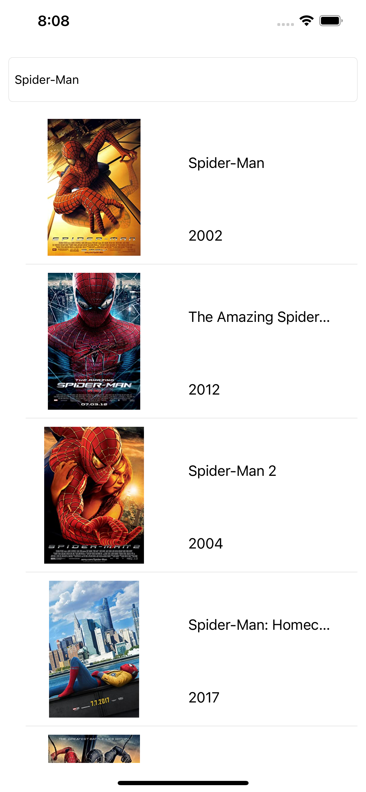
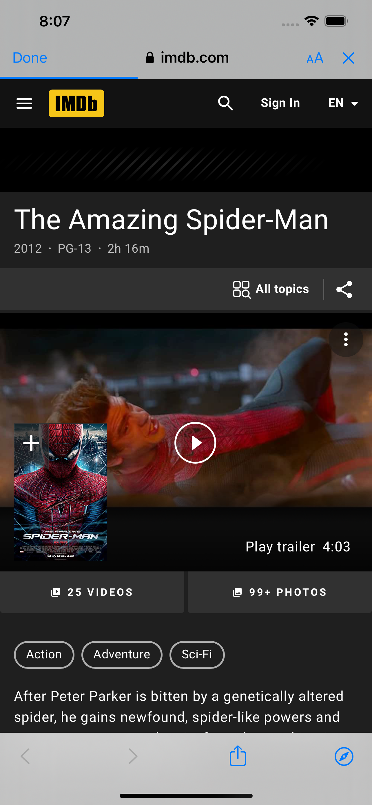

# Movie-Searcher
It's a movie searching iOS app ,in which i have used  OMDB movie api and fetched the movie data in a tableview. In this project I have implemented some core concepts like User Interface design, getting data from API, table views, cells, and more. 

 .    .     
